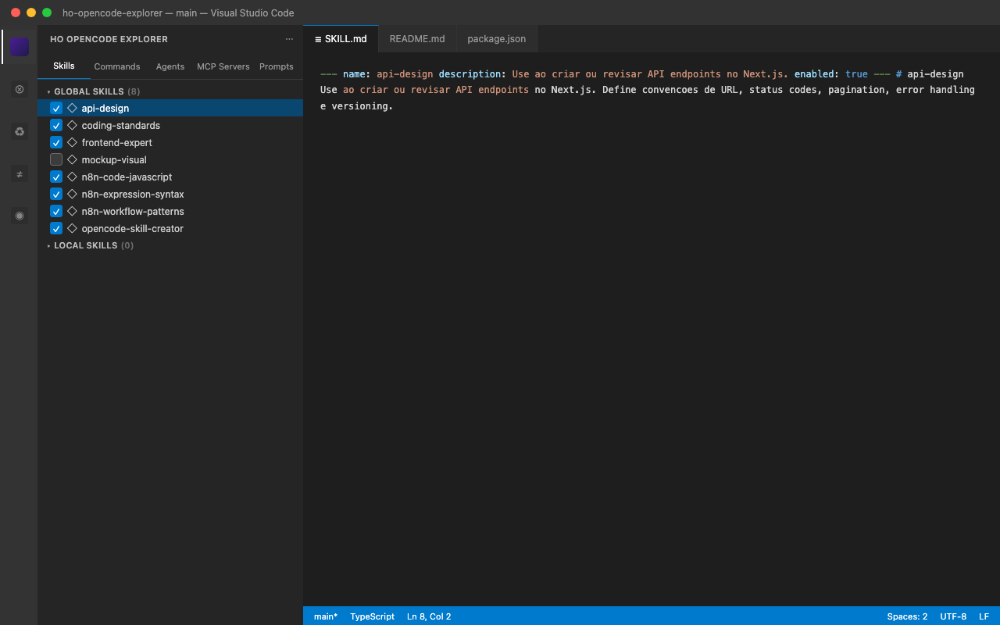
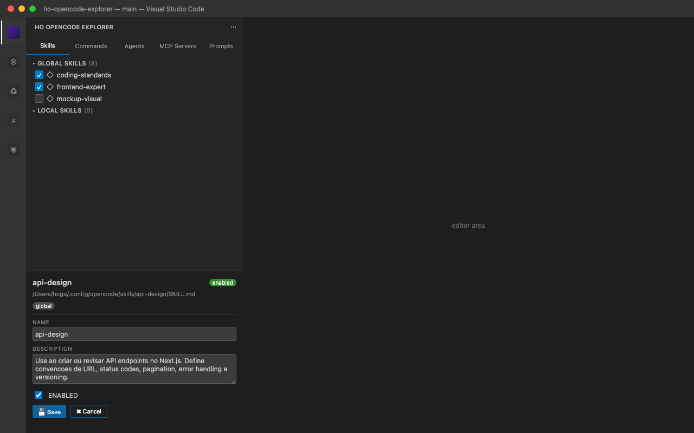

# HO OpenCode Explorer

[](https://github.com/ho/ho-opencode-explorer/actions/workflows/ci.yml)
[](https://marketplace.visualstudio.com/items?itemName=ho.ho-opencode-explorer)
[](LICENSE)

Browse and manage your OpenCode setup directly from the VS Code sidebar — **skills, commands, agents, MCP servers, and prompts & instructions** — without leaving your editor.

If you live in VS Code and work with [OpenCode](https://github.com/anomalyco/opencode) every day, you spend a lot of time switching between your editor and the terminal to inspect what skills are available, which commands you have, how an agent is configured, or whether an MCP server is enabled. This extension brings all of that information into a native sidebar UI, right next to your code, so you can explore and manage your OpenCode setup in place.

## Screenshots





## Features

Five native tree views in the activity bar, plus a shared detail panel:

- **Skills** — browse global and local OpenCode skills, organized by source. Toggle any skill on/off with a checkbox (edits the `SKILL.md` frontmatter) and see its description, path, and YAML parse errors.
- **Commands** — browse your slash commands, both `.md` files and inline entries from `opencode.json`.
- **Agents** — inspect your agents, whether defined inline in `opencode.json` or as `.md` files, with their mode, model, temperature, tools, and referenced prompt files.
- **MCP Servers** — see configured MCP servers from `opencode.json` and project `.mcp.json`, their transport (remote/stdio/http/sse), and whether they are enabled.
- **Prompts & Instructions** — browse prompt files and instructions (`AGENTS.md`, `CLAUDE.md`) with a content preview.
- **Auto-refresh** — file watchers keep every view in sync as your OpenCode files change.
- **Version check** — notified when a new extension version is released.

Select any item to open its details in the bottom panel, then open the source file or copy its path with one click.

## Installation

**From the VS Code Marketplace:**

```
ext install ho.ho-opencode-explorer
```

**From a VSIX file:**

1. Download or build the `.vsix` (e.g. `npx @vscode/vsce package`)
2. In VS Code open the Extensions view (`⌘⇧X`), click the **"..."** menu, and choose **Install from VSIX...**
3. Select the file and reload the window

## Usage

1. Click the **HO OpenCode Explorer** icon in the activity bar (left sidebar)
2. Explore the tabs: **Skills**, **Commands**, **Agents**, **MCP Servers**, and **Prompts & Instructions**
3. Click a checkbox to enable/disable a skill
4. Click an item to view its details in the bottom panel
5. Use the ↻ button in the tab header to refresh or check for updates

## Requirements

- VS Code **1.85.0** or higher
- An [OpenCode](https://github.com/anomalyco/opencode) installation with content in the standard locations (e.g. `~/.config/opencode/`)

## Contributing

See [CONTRIBUTING.md](CONTRIBUTING.md) for development setup and guidelines.

## Security

See [SECURITY.md](SECURITY.md) for how to report a vulnerability.

## Changelog

See [CHANGELOG.md](CHANGELOG.md) for release history.

## License

MIT — see [LICENSE](LICENSE) for details.
